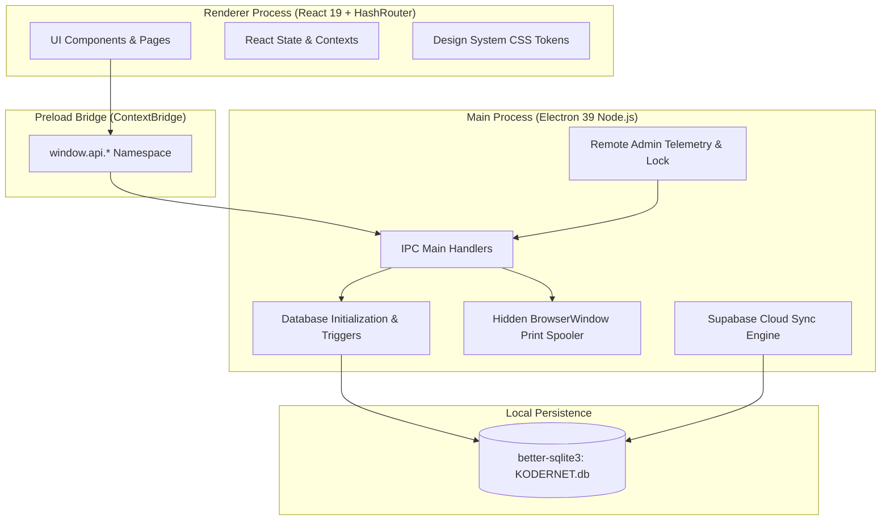
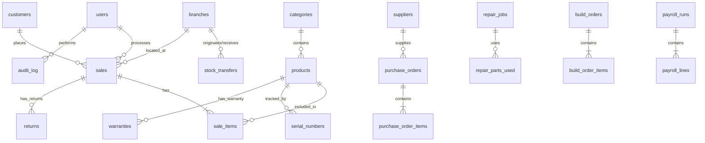
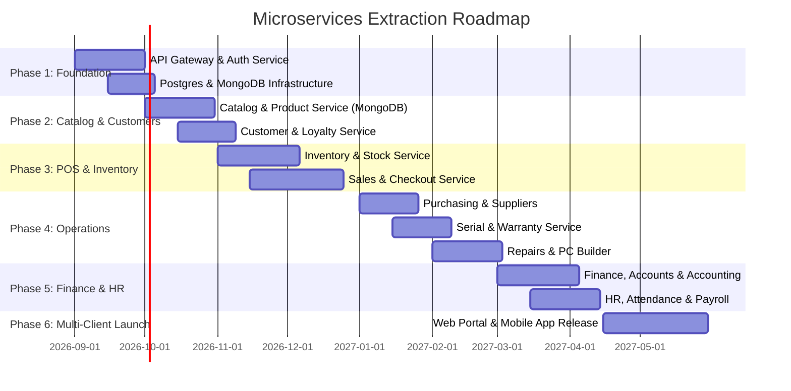

# KODERNET POS 2.0 — System Architecture, Complete Feature Inventory & Microservices Extraction Roadmap

> **Document Purpose**: This document provides an exhaustive technical analysis of the existing **KODERNET** desktop Point of Sale (POS) monolithic application, its data models, IPC architecture, and feature matrix. Additionally, it outlines the step-by-step migration plan to a **Multi-Tier Microservices Architecture** supporting multiple client platforms (Desktop, Web, Mobile) powered by a single, unified backend core.

---

## TABLE OF CONTENTS
1. [Executive Summary & Vision](#1-executive-summary--vision)
2. [Current Architecture & System Design](#2-current-architecture--system-design)
3. [Exhaustive Feature & Functionality Inventory](#3-exhaustive-feature--functionality-inventory)
4. [Database Schema & Data Entity Inventory (SQLite)](#4-database-schema--data-entity-inventory-sqlite)
5. [IPC Channel & Preload API Surface (`window.api.*`)](#5-ipc-channel--preload-api-surface-windowapi)
6. [Hardware & Peripheral Integrations](#6-hardware--peripheral-integrations)
7. [Target Architecture: Multi-Tier Microservices Vision](#7-target-architecture-multi-tier-microservices-vision)
8. [Microservices Breakdown & Database Technology Selection](#8-microservices-breakdown--database-technology-selection)
9. [Service-by-Service Extraction Roadmap (Strangler Fig Pattern)](#9-service-by-service-extraction-roadmap-strangler-fig-pattern)
10. [Multi-Client Integration Strategy (Web, Mobile, Desktop)](#10-multi-client-integration-strategy-web-mobile-desktop)

---

## 1. EXECUTIVE SUMMARY & VISION

### 1.1 What is KODERNET?
**KODERNET** is a feature-rich, high-performance Point of Sale (POS) and Enterprise Resource Planning (ERP) desktop solution tailored for bakeries, computer tech shops, electronics retailers, and general merchants in Sri Lanka. 

The current system is built as an Electron desktop monolith utilizing an offline-first architecture with SQLite (`better-sqlite3`), React 19, and Vite. It incorporates localized business requirements such as:
- **Bilingual Support**: Dual English (`name`) and Sinhala (`name_si`) product naming.
- **Sri Lankan Banking & Statutory Compliance**: Pre-configured Sri Lankan banks (BOC, Sampath, Commercial, HNB, etc.), EPF (8% employee / 12% employer) and ETF (3% employer) payroll calculations.
- **Hardware Automation**: Silent printing for 80mm thermal receipts, A4 invoices, and Code128 barcode sticker labels via native OS print spoolers without browser dialog prompts.
- **Specialized Industry Workflows**: Device repair job sheets with Kanban state tracking, custom PC/computer assembling with compatibility engines, inter-branch stock transfers, warranty registries, and serial/IMEI tracking.

### 1.2 The Multi-Tier Microservices Vision
While the existing desktop monolith excels in standalone, single-store offline environments, scaling across enterprise chains, web e-commerce, and mobile manager applications requires decoupling the business logic from the Electron desktop runtime.

**Goals of the Architectural Transformation**:
1. **Single Source of Truth**: Consolidate core business logic into cloud-ready, domain-driven microservices.
2. **Multi-Client Ecosystem**: Enable seamless interaction across:
   - **Desktop App** (Windows/macOS POS Cashier terminals - high speed, silent printing, offline cache).
   - **Web App** (Store Admin Portal, Customer E-commerce, Inventory Management).
   - **Mobile App** (iOS/Android Manager Dashboards, Stock Auditing, Delivery Driver App).
3. **Database Specialization**: Replace the single SQLite database with polyglot persistence:
   - **PostgreSQL with Prisma ORM** for transactional, relational, and financial domains requiring strict ACID guarantees.
   - **MongoDB** for document-heavy, schema-flexible domains such as audit trails, notification logs, product catalogs with dynamic attributes, and build order templates.

---

## 2. CURRENT ARCHITECTURE & SYSTEM DESIGN

### 2.1 Monolithic Architecture Diagram



### 2.2 Core Tech Stack (Current Monolith)
- **Desktop Runtime**: Electron 39.2.6 (Node.js + Chromium)
- **Frontend UI Framework**: React 19.2.1
- **Bundler & Build Pipeline**: electron-vite 5.0.0 + Vite 7.2.6
- **Routing**: `react-router-dom` 7.14.2 using `HashRouter` (required for Electron `file://` protocol)
- **Local Database**: SQLite 3 via `better-sqlite3` 12.9.0 (native C++ binding in WAL mode)
- **Design System**: Custom CSS variables (`design-system.css`), Flat UI design philosophy (border layering, zero shadows), Forest Green palette (`#1B6B3A`), Dark Mode (`data-theme="dark"`).
- **Icons**: `lucide-react` 1.14.0
- **Cloud Replication**: Custom push/pull sync engine connected to Supabase Postgres (`pg` driver)

---

## 3. EXHAUSTIVE FEATURE & FUNCTIONALITY INVENTORY

The system consists of **25+ fully functional modules**. The table below details every feature and logic link in the codebase:

### 3.1 Authentication & User Management
- **PIN-Based Split-Layout Login**: Fast cashier login via 4-digit PIN or password with numerical keypad UI.
- **Role-Based Access Control (RBAC)**: Roles (`admin`, `manager`, `cashier`, `technician`, `driver`). Non-admin users are restricted from financial reports, settings, and sensitive CRUD operations.
- **Multi-Branch User Assignments**: Mapping users to specific branch locations with default branch fallback.
- **Active / Inactive Status**: Soft deactivation of staff without breaking historical sales records.

### 3.2 POS Checkout & Billing Engine
- **Product Search & Quick Grid**: Category filter tabs, barcode scanner input buffer, live instant search.
- **Cart Management**: Item quantity adjustments, line discounts, custom items, customer assignment.
- **Wholesale & Dual Pricing**: Automatic pricing tier switching (`Retail Mode` vs `Wholesale Mode`) based on customer type (`wholesale`/`corporate`), product `wholesale_price`, and `min_wholesale_qty` threshold.
- **Loyalty Program & Points Redemption**: Auto-calculation of tier discounts (Silver 2%, Gold 5%, Platinum 10%), slider-based points redemption capped at cart total, earn preview (+X points per Rs 100).
- **Tax Calculations**: Configurable sales tax rate automatically applied to line items and stored per sale.
- **Multi-Payment Methods**: Cash with change calculation, Card, Mobile Pay, Bank Transfer, Split Payment.
- **Draft Sales**: Save current cart as a draft order and resume later.
- **Receipt & Invoice Print**: Instant silent thermal receipt printing (80mm) or PDF invoice generation.

### 3.3 Product Catalog & Category Management
- **Bilingual Naming**: English `name` + Sinhala `name_si` for Sri Lankan operations.
- **Category Hierarchy**: Category sorting, custom Lucide icons, soft active toggle.
- **SKU & Barcode Tracking**: Auto-generation of SKUs by category (`getNextSku`), Code128 barcode validation.
- **Unit Types**: Support for `unit`, `cup`, `bottle`, `pack`, `glass`, `kg`, `meter`.
- **Media Gallery**: Image upload with main display image and secondary gallery URLs (integrated with Supabase Storage).
- **Low Stock Thresholds**: Per-product low stock alerts and threshold indicators.

### 3.4 Inventory & Stock Control
- **Real-Time Stock Levels**: Auto-deduction on sales, restoration on returns.
- **Manual Stock Adjustments**: Stock adjustment modal with audit logging (reasons: Damaged, Expired, Recount, Received, Theft, Return).
- **Stock Movement Log**: `stock_movements` ledger tracking every quantity change, source document, and user actor.
- **Low Stock Scan & Alerts**: In-app notifications triggered automatically when stock drops below threshold.

### 3.5 Serial Number & IMEI Registry
- **Unit-Level Serial Tracking**: Tracking high-value inventory (laptops, phones, appliances) by unique serial/IMEI.
- **Status Lifecycle**: `In Stock` → `Sold` → `In Repair` → `Returned` → `Scrapped`.
- **Full History Timeline**: Complete event trail (`serial_events`) from PO receipt to customer sale.
- **Bulk CSV Import**: Drag-and-drop CSV parser for bulk serial onboarding.

### 3.6 Warranty Management
- **Registry & Certificate Generation**: Automatic warranty creation upon selling serial-tracked products.
- **Days-Remaining Visual Rules**: Color-coded countdown badges (Green >60 days, Amber 1-60 days, Red Expired).
- **Claim Workflow**: Process claim modal tracking issues, assigned technician, parts replaced, resolution status (`Open` → `In Progress` → `Resolved` → `Rejected`), printable Warranty Certificates.

### 3.7 Repair & Job Sheet Management (TechShop Workflow)
- **Dual View Interface**: Drag-and-Drop Kanban Board (5 columns: `Received` → `Diagnosing` → `In Progress` → `Quality Check` → `Ready`) + Filterable Table View.
- **Job Sheet Form**: Customer lookup, device details (type/brand/model/serial), accessory chips, reported issue, diagnosis, repair parts consumed from stock, labor charge, technician notes, typed customer signature.
- **One-Click Invoice Generation**: Converting completed repair jobs into a POS sale atomically (parts + labor line items), deducting parts from inventory, updating job status to `Delivered`.

### 3.8 Custom Computer / PC Builder Assembling
- **Component Configurator**: Slot-based PC builder (CPU, Motherboard, RAM, Storage, GPU, PSU, Case, Cooler).
- **Stock & Cost Integration**: Live stock availability badges, component unit cost, dynamic markup % adjustment, real-time margin calculation.
- **Compatibility Warning Engine**: Rules detecting missing required slots, duplicate CPU/Motherboard, GPU requiring high-wattage PSU.
- **Build Templates**: Reusable spec templates ("Gaming Budget", "Office Workstation", "Editing Rig") with one-click build instantiation.
- **One-Click Sale Conversion**: Converts completed build orders into POS invoices, deducting all individual PC parts from stock.

### 3.9 Supplier & Purchase Order Management
- **Supplier Master Directory**: Contact info, payment terms, Sri Lankan bank account details (BOC, Sampath, Commercial, HNB).
- **Purchase Order (PO) Lifecycle**: `Draft` → `Ordered` → `Partial` → `Received` → `Cancelled`.
- **Stock Receiving Workflow**: Receiving items against a PO with automatic stock increment and serial number generation.
- **Payables Ledger**: Tracking outstanding payments, record payment entries, partial payment status.

### 3.10 Multi-Branch & Inter-Branch Stock Transfers
- **Location Management**: Branch registration, default branch setting, user-to-branch permissions.
- **Inter-Branch Transfer Lifecycle**: `Requested` → `Approved` → `Dispatched` → `Received` → `Cancelled`.
- **Atomic Stock Movement**: Source branch stock deduction upon dispatch, target branch stock addition upon receive, discrepancy logging.

### 3.11 Local Deliveries & Shipment Tracking
- **Shipment Management**: Linking POS sales to delivery orders with driver assignment and vehicle tracking.
- **COD (Cash on Delivery)**: COD amount tracking, toggle collected status, driver settlement.
- **Status Lifecycle**: `Pending` → `Dispatched` → `Delivered` → `Failed` → `Rescheduled`.
- **Daily Route Sheet Printer**: Generates printable driver route sheets with stop checklists via thermal printer.

### 3.12 Sales Quotations
- **Quotation Builder**: Create professional quotes with valid-until dates, custom discounts, and printable letterheads.
- **One-Click Convert to Sale**: Converts accepted quotations directly into active POS sales with immediate stock reservation.

### 3.13 Returns, Refunds & Credit Notes
- **5-Step Return Wizard**: Search Sale → Select Items & Quantities → Select Reason & Resale Condition → Choose Resolution (`Refund`, `Exchange`, `Credit Note`) → Confirm.
- **Inventory Restoration**: Auto-restoration of resaleable items to stock; quarantine for damaged items.
- **Credit Note Generation**: Printable credit note vouchers for future purchases.

### 3.14 Expense Management
- **Category & Budget Controls**: 10+ pre-seeded categories (Rent, Utilities, Salaries, Logistics, Maintenance), monthly category budget caps with visual progress bars.
- **Approval Workflow**: Non-admin staff submissions land in `Pending` state; admins approve or reject with reason.

### 3.15 Financial Accounts & Cash Flow Reporting
- **Multi-Account Support**: Cash Drawers, Bank Accounts, Safes, Mobile Wallets with balance tracking.
- **Fund Transfers**: Atomic inter-account transfers (Debit Source + Credit Destination).
- **P&L (Profit & Loss) Statement**: Automatic calculation of Revenue, Cost of Goods Sold (COGS), Gross Profit, Operating Expenses, Net Profit over date ranges.
- **Cash Flow Statement**: Inflows (Sales, Credits) vs Outflows (Expenses, Purchases, Debits).

### 3.16 HR, Attendance & Payroll Management
- **Employee Profiles**: NIC numbers, basic salaries, EPF/ETF registration numbers, contact details.
- **Attendance Calendar**: Monthly attendance matrix, daily check-in/out logging, single/bulk attendance entry.
- **Leave Request Workflow**: Annual, Sick, Casual, Maternity leave requests with admin approval and balance tracking.
- **Payroll Calculation Engine**: Auto-calculation of basic salary pro-rated by attendance days, EPF Employee 8% deduction, EPF Employer 12% contribution, ETF Employer 3% contribution, net salary slips.

### 3.17 Notification Center
- **Alert Scanning Engine**: Automatic 30-second background polling for low stock, overdue repair jobs, expiring warranties, pending expense approvals, overdue POs.
- **TopBar Dropdown & Bell**: Unread counter badge, quick action links to relevant screens.

### 3.18 Advanced Barcode Label Printer
- **Code128 SVG Generator**: Pure JavaScript inline Code128 subset B SVG barcode generator (zero external NPM dependencies).
- **Template Layouts**: Small (36x22mm), Medium (50x30mm), Large (80x50mm).
- **Batch Print Spooling**: Concatenated multi-label HTML output sent in a single printer payload.

### 3.19 Cloud Sync & Replication (Supabase)
- **Offline-First Outbox Pattern**: Every SQLite write triggers an append-only entry in `sync_outbox`.
- **Bidirectional Pull Worker**: Pulls remote Postgres changes using timestamp watermark (`updated_at`).
- **UUID Primary Keys**: Every table uses a global UUID `id` to avoid key collisions across devices.

### 3.20 Central Admin Telemetry & Remote Lock (Kill-Switch)
- **Heartbeat Telemetry**: Sends app health, sales rollups, and system stats to the central license server.
- **Remote Lock Command**: Instant application freeze (`<RemoteLock>`) triggered remotely for unpaid subscriptions or security incidents.

---

## 4. DATABASE SCHEMA & DATA ENTITY INVENTORY (SQLITE)

The current monolithic database (`KODERNET.db`) contains **44 synchronized data tables**. Below is the entity breakdown:



### 4.1 Table Reference List

| # | Table Name | Key Purpose | Primary Key | Key Foreign Keys |
|---|------------|-------------|-------------|------------------|
| 1 | `users` | Staff, cashiers, admins, credentials | `id` (TEXT UUID) | `branch_id` |
| 2 | `categories` | Product category taxonomy | `id` (TEXT UUID) | - |
| 3 | `products` | Product master, prices, stock, Sinhala names | `id` (TEXT UUID) | `category_id` |
| 4 | `customers` | Customer directory, loyalty points, type | `id` (TEXT UUID) | - |
| 5 | `sales` | Transactions, invoices, payment totals | `id` (TEXT UUID) | `cashier_id`, `customer_id`, `branch_id` |
| 6 | `sale_items` | Line items for sales transactions | `id` (TEXT UUID) | `sale_id`, `product_id` |
| 7 | `settings` | System-wide key-value configuration | `key` (TEXT) | - |
| 8 | `returns` | Refund/Exchange transaction header | `id` (TEXT UUID) | `sale_id`, `customer_id`, `cashier_id` |
| 9 | `return_items` | Line items returned in a refund | `id` (TEXT UUID) | `return_id`, `product_id` |
| 10 | `audit_log` | Immutable activity audit trail | `id` (TEXT UUID) | `user_id` |
| 11 | `suppliers` | Supplier registry & Sri Lanka bank info | `id` (TEXT UUID) | - |
| 12 | `purchase_orders` | Purchase order header & status | `id` (TEXT UUID) | `supplier_id`, `branch_id` |
| 13 | `purchase_order_items` | Products ordered in a PO | `id` (TEXT UUID) | `po_id`, `product_id` |
| 14 | `serial_numbers` | Serial/IMEI master registry | `id` (TEXT UUID) | `product_id`, `po_id`, `sale_id`, `customer_id` |
| 15 | `serial_events` | Life cycle history log of a serial | `id` (TEXT UUID) | `serial_id`, `user_id` |
| 16 | `warranties` | Active warranty registrations | `id` (TEXT UUID) | `product_id`, `serial_id`, `sale_id`, `customer_id` |
| 17 | `warranty_claims` | Repair/Replacement warranty claim entries | `id` (TEXT UUID) | `warranty_id` |
| 18 | `quotations` | Sales quotes header | `id` (TEXT UUID) | `customer_id`, `created_by` |
| 19 | `quotation_items` | Products listed on a quotation | `id` (TEXT UUID) | `quotation_id`, `product_id` |
| 20 | `branches` | Physical store locations | `id` (TEXT UUID) | - |
| 21 | `user_branches` | Mapping of users to branch access | `id` (TEXT UUID) | `user_id`, `branch_id` |
| 22 | `stock_transfers` | Inter-branch stock movement headers | `id` (TEXT UUID) | `from_branch_id`, `to_branch_id` |
| 23 | `stock_transfer_items` | Products transferred between stores | `id` (TEXT UUID) | `transfer_id`, `product_id` |
| 24 | `shipments` | Delivery orders & COD tracking | `id` (TEXT UUID) | `sale_id`, `customer_id`, `driver_id`, `branch_id` |
| 25 | `shipment_items` | Products included in a shipment | `id` (TEXT UUID) | `shipment_id`, `product_id` |
| 26 | `repair_jobs` | Device repair sheets & Kanban state | `id` (TEXT UUID) | `customer_id`, `technician_id`, `branch_id` |
| 27 | `repair_parts_used` | Inventory parts consumed in repair | `id` (TEXT UUID) | `repair_job_id`, `product_id` |
| 28 | `build_orders` | Custom PC build orders | `id` (TEXT UUID) | `customer_id`, `template_id`, `branch_id` |
| 29 | `build_order_items` | PC components in a custom build | `id` (TEXT UUID) | `build_order_id`, `product_id` |
| 30 | `build_templates` | PC build specification templates | `id` (TEXT UUID) | - |
| 31 | `build_template_items` | Component slots in a build template | `id` (TEXT UUID) | `template_id`, `product_id` |
| 32 | `expense_categories` | Categories for expense tracking | `id` (TEXT UUID) | - |
| 33 | `expenses` | Expense vouchers & approval state | `id` (TEXT UUID) | `category_id`, `branch_id`, `user_id`, `account_id` |
| 34 | `expense_splits` | Multi-category split expense entries | `id` (TEXT UUID) | `expense_id`, `category_id` |
| 35 | `payment_accounts` | Cash drawers, bank accounts, safes | `id` (TEXT UUID) | `branch_id` |
| 36 | `account_transactions` | Account deposit/withdrawal ledger | `id` (TEXT UUID) | `account_id`, `user_id` |
| 37 | `chart_of_accounts` | Double-entry general ledger accounts | `id` (TEXT UUID) | - |
| 38 | `journal_entries` | Accounting journal vouchers | `id` (TEXT UUID) | `created_by` |
| 39 | `journal_lines` | Debit and Credit journal lines | `id` (TEXT UUID) | `entry_id`, `account_id` |
| 40 | `attendance` | Daily employee check-in/out records | `id` (TEXT UUID) | `user_id`, `branch_id` |
| 41 | `leave_requests` | Employee leave applications | `id` (TEXT UUID) | `user_id`, `approved_by` |
| 42 | `leave_balances` | Annual leave allowances and used days | `id` (TEXT UUID) | `user_id` |
| 43 | `payroll_runs` | Monthly payroll calculation headers | `id` (TEXT UUID) | `created_by` |
| 44 | `payroll_lines` | Payslips per employee with EPF/ETF | `id` (TEXT UUID) | `payroll_run_id`, `user_id` |

---

## 5. IPC CHANNEL & PRELOAD API SURFACE (`window.api.*`)

Communication between the React frontend and the Electron main process is strictly gated through IPC handles defined in `src/preload/index.js`. Below is the complete mapping:

```
[React Component] ──> window.api.<namespace>.<method>(args)
                          │
                          ▼ (ipcRenderer.invoke)
[Main Process]    ──> ipcMain.handle('<namespace>:<action>', handler)
                          │
                          ▼
                  [Database Service / Query Layer]
```

### 5.1 Namespace API Summary

- **`api.auth`**: `login(username, pin)`
- **`api.categories`**: `list()`, `create(data)`, `update(id, data)`, `delete(id)`
- **`api.products`**: `list(opts)`, `get(id)`, `getByBarcode(barcode)`, `create(data)`, `update(id, data)`, `delete(id)`, `history(id)`, `getNextSku(catId)`, `getImages(id)`, `setGallery(id, urls)`
- **`api.sales`**: `create(data)`, `get(id)`, `recent(limit)`, `list(filters)`, `update(id, data)`, `delete(id)`, `recordPayment(data)`, `createDraft(data)`, `listDrafts()`, `deleteDraft(id)`
- **`api.customers`**: `list(opts)`, `get(id)`, `create(data)`, `update(id, data)`, `delete(id)`, `recordPayment(data)`
- **`api.suppliers`**: `list(opts)`, `get(id)`, `create(data)`, `update(id, data)`, `delete(id)`, `kpis()`, `products(id)`
- **`api.purchases`**: `list(opts)`, `get(id)`, `create(data)`, `update(id, data)`, `delete(id)`, `receive(id, items)`, `updatePayment(id, data)`, `kpis()`
- **`api.serials`**: `list(opts)`, `getByCode(code)`, `get(id)`, `byPO(poId)`, `updateStatus(id, status)`, `bulkCreate(serials)`
- **`api.warranties`**: `list(opts)`, `get(id)`, `create(data)`, `update(id, data)`, `void(id)`, `processClaim(id, data)`, `updateClaim(id, data)`, `kpis()`
- **`api.quotations`**: `list(opts)`, `get(id)`, `create(data)`, `update(id, data)`, `delete(id)`, `convert(id)`, `kpis()`, `send(id, html)`
- **`api.branches`**: `list(opts)`, `get(id)`, `create(data)`, `update(id, data)`, `delete(id)`, `setDefault(id)`, `getUsers(id)`, `assignUser(bId, uId)`, `removeUser(bId, uId)`
- **`api.transfers`**: `list(opts)`, `get(id)`, `create(data)`, `update(id, data)`, `approve(id)`, `dispatch(id, data)`, `receive(id, items)`, `cancel(id)`, `kpis()`
- **`api.shipments`**: `list(opts)`, `get(id)`, `drivers()`, `create(data)`, `update(id, data)`, `dispatch(id, data)`, `deliver(id, data)`, `fail(id, reason)`, `reschedule(id, date)`, `markCOD(id, status)`
- **`api.repairs`**: `list(opts)`, `get(id)`, `create(data)`, `update(id, data)`, `updateStatus(id, status)`, `generateInvoice(id)`, `delete(id)`, `kpis()`
- **`api.assembling`**: `list(opts)`, `get(id)`, `create(data)`, `update(id, data)`, `updateStatus(id, status)`, `convert(id, method)`, `templates.list()`, `templates.create(data)`
- **`api.expenses`**: `list(opts)`, `create(data)`, `approve(id)`, `reject(id, reason)`, `categories.list()`, `categories.update(id, data)`
- **`api.accounts`**: `list()`, `create(data)`, `recordTransaction(id, data)`, `transfer(from, to, amount)`, `financialSummary()`, `cashFlow()`
- **`api.hr`**: `employees.list()`, `attendance.mark()`, `attendance.bulk()`, `leave.create()`, `leave.approve()`, `payroll.create()`, `payroll.finalize()`
- **`api.notifications`**: `list()`, `unreadCount()`, `markRead()`, `scan()`, `preferences.get()`, `preferences.update()`
- **`api.printer`**: `getConfig()`, `getList()`, `printReceipt(html)`, `printInvoice(html)`, `printSticker(html)`
- **`api.cloud`**: `getConfig()`, `saveConfig()`, `status()`, `testConnection()`, `pushNow()`, `pullNow()`
- **`api.excel`**: `exportProducts()`, `importProducts()`, `exportSuppliers()`, `importSuppliers()`, `exportCustomers()`, `importCustomers()`

---

## 6. HARDWARE & PERIPHERAL INTEGRATIONS

1. **Barcode Scanners**:
   - Integrated in `Billing.jsx` via global `keydown` buffer listener detecting rapid keypress sequences (<50ms inter-char delay). Automatically triggers product lookup upon receiving `Enter`.
2. **Thermal Receipt Printers (80mm / 58mm)**:
   - Configured via `PRINTER_CONFIG` in `src/main/index.js`.
   - Generates thermal-optimized HTML markup and executes silent background printing (`webContents.print({ silent: true })`).
3. **Barcode Label Printers (Sticker Roll)**:
   - Code128 SVG string built directly in JS. Formatted to exact sticker dimensions (36x22mm, 50x30mm, 80x50mm) and spooled silently.

---

## 7. TARGET ARCHITECTURE: MULTI-TIER MICROSERVICES VISION

To expand KODERNET beyond a single desktop PC into an enterprise multi-store, web, and mobile ecosystem, we will extract the monolithic database and query layer into **domain-driven microservices** exposed through a unified API Gateway.

```mermaid
graph TD
    subgraph "Presentation Tier (Clients)"
        Desktop[Desktop POS - Tauri / Electron]
        Web[Web Portal - Next.js 15]
        Mobile[Mobile App - React Native / Expo]
    end

    subgraph "API Gateway & Security Tier"
        Gateway[Kong / Envoy / NestJS API Gateway]
        AuthGuard[JWT / OAuth2 / RBAC Guard]
        RateLimit[Rate Limiter & Redis Cache]
    end

    subgraph "Core Microservices Tier (Node.js / Go)"
        AuthSvc[1. Auth & User Service]
        CatalogSvc[2. Catalog & Product Service]
        InventorySvc[3. Inventory & Stock Service]
        SalesSvc[4. Sales & POS Checkout Service]
        CustomerSvc[5. Customer & Loyalty Service]
        PurchasingSvc[6. Supplier & Purchasing Service]
        RepairSvc[7. Repair & Warranty Service]
        AssemblySvc[8. PC Builder Service]
        LogisticsSvc[9. Shipment & Delivery Service]
        FinanceSvc[10. Finance & Accounting Service]
        HRSvc[11. HR & Payroll Service]
        NotifySvc[12. Notification Service]
    end

    subgraph "Persistence Tier (Polyglot Data Stores)"
        Postgres[(PostgreSQL + Prisma ORM)]
        Mongo[(MongoDB)]
        RedisCache[(Redis Cache & Session Store)]
    end

    Desktop --> Gateway
    Web --> Gateway
    Mobile --> Gateway

    Gateway --> AuthGuard
    AuthGuard --> RateLimit
    RateLimit --> Core Microservices Tier

    AuthSvc --> Postgres
    SalesSvc --> Postgres
    FinanceSvc --> Postgres
    HRSvc --> Postgres
    PurchasingSvc --> Postgres
    InventorySvc --> Postgres
    CustomerSvc --> Postgres

    CatalogSvc --> Mongo
    NotifySvc --> Mongo
    AssemblySvc --> Mongo
    RepairSvc --> Mongo

    Core Microservices Tier --> RedisCache
```

---

## 8. MICROSERVICES BREAKDOWN & DATABASE TECHNOLOGY SELECTION

We have selected **PostgreSQL with Prisma ORM** for transactional integrity, financial ledgers, and relational structures, and **MongoDB** for document flexibility, dynamic specs, and audit trails.

### 8.1 Detailed Service Matrix

| Service Name | Primary Responsibilities | Database Choice | Tech Rationale |
|--------------|--------------------------|-----------------|----------------|
| **1. Auth & User Service** | User registration, PIN verification, JWT tokens, RBAC, Branch permissions | **PostgreSQL + Prisma** | Strict relational mapping between users, roles, and branch assignments. |
| **2. Catalog & Product Service** | Products, categories, barcodes, Sinhala translations, dynamic attributes, media gallery | **MongoDB** | High flexibility for varied product attributes (electronics specs vs bakery expiry dates), fast read caching. |
| **3. Inventory & Stock Service** | Multi-branch stock levels, movements log, low stock thresholds, inter-branch transfers | **PostgreSQL + Prisma** | Requires ACID transactions to prevent negative stock and maintain audit integrity. |
| **4. Sales & POS Checkout Service** | POS checkout engine, invoices, draft sales, dual pricing, tax calculation, cashier shift sessions | **PostgreSQL + Prisma** | Mission-critical financial transaction processing requiring strict ACID compliance. |
| **5. Customer & Loyalty Service** | Customer profiles, loyalty tiers computation, points ledger, purchase history | **PostgreSQL + Prisma** | Atomic balances for points ledger and strong relational mapping to sales. |
| **6. Supplier & Purchasing Service** | Supplier profiles, Sri Lankan bank accounts, PO creation, goods received notes | **PostgreSQL + Prisma** | Relational PO line item tracking and financial payables ledger. |
| **7. Repair & Warranty Service** | Kanban job sheets, technician assignments, repair parts, serial/IMEI registry, warranty claims | **MongoDB** (Repairs) + **Postgres** (Warranties) | Flexible document structure for repair diagnosis & job history; strict SQL for warranty legal registry. |
| **8. PC Builder Service** | Custom PC assembling, component configurator, compatibility rules engine, spec templates | **MongoDB** | Document models ideal for complex nested component slots and arbitrary spec templates. |
| **9. Shipment & Delivery Service** | Delivery orders, driver assignments, COD tracking, daily route sheet generation | **PostgreSQL + Prisma** | Relational links between drivers, branch sales, and financial COD collection. |
| **10. Finance & Accounting Service** | Expense approvals, budgets, payment accounts, cash flow, P&L statements, double-entry GL | **PostgreSQL + Prisma** | General Ledger requires rigid double-entry relational balance matching (Debits = Credits). |
| **11. HR & Payroll Service** | Employee HR details, attendance matrix, leave workflow, EPF (8%/12%) and ETF (3%) payroll runs | **PostgreSQL + Prisma** | Payroll calculations require strict historical accuracy and compliance auditing. |
| **12. Notification & Audit Service** | In-app alerts, WhatsApp gateway, audit log trail, background state scanning | **MongoDB** | High write throughput, unstructured log payloads (`before_data`/`after_data` JSON snapshots). |
| **13. Hardware & Print Gateway** | Local desktop agent for thermal printing, Code128 barcode generation, local print spooling | **N/A (Local Edge Agent)** | Lightweight Go or Node.js daemon running on cashier PCs to interface with physical USB/Network printers. |

---

## 9. SERVICE-BY-SERVICE EXTRACTION ROADMAP (STRANGLER FIG PATTERN)

To migrate from the monolith without downtime, we will adopt the **Strangler Fig Pattern**, gradually replacing monolith IPC calls with microservice HTTP/gRPC endpoints.



### 9.1 Step-by-Step Phase Breakdown

#### Phase 1: Core Foundation & Security Infrastructure
- Deploy **Kong API Gateway** or NestJS Gateway.
- Implement **Auth & User Service** using NestJS, PostgreSQL, Prisma, JWT, and bcrypt.
- Migrate user credentials and branch assignments. Desktop client preload bridge (`window.api.auth`) updated to HTTP client call.

#### Phase 2: Catalog, Products & Customer Services
- Extract `categories`, `products`, `banners`, `vouchers` into **Catalog Service** backed by MongoDB.
- Extract `customers` and `loyalty_tiers` into **Customer & Loyalty Service** backed by PostgreSQL + Prisma.
- Synchronize product images via S3-compatible object storage (MinIO / Supabase Storage).

#### Phase 3: Core POS & Inventory Service
- Extract `products.stock_qty`, `stock_transfers`, and `stock_movements` into **Inventory Service** (Postgres + Prisma).
- Extract POS checkout, sales, invoices, and draft sales into **Sales & POS Service** (Postgres + Prisma).
- Implement Redis cache for instant product catalog lookups at checkout.

#### Phase 4: Specialist Operations (Repairs, Assembling, Warranties, Shipments)
- Extract repair job sheets and computer assembling into **Repair & Build Services** (MongoDB).
- Extract serial numbers and warranties into **Serial & Warranty Service** (Postgres).
- Extract shipments and delivery tracking into **Logistics Service** (Postgres).

#### Phase 5: Finance, HR & Notifications
- Extract general ledger, accounts, expenses, P&L into **Finance Service** (Postgres + Prisma).
- Extract employee HR, attendance, leave, and Sri Lanka EPF/ETF payroll into **HR Service** (Postgres + Prisma).
- Extract audit logs and notification alerts into **Notification & Audit Service** (MongoDB).

#### Phase 6: Multi-Client Platform Rollout
- **Web App**: Launch Next.js 15 Admin Portal & Customer E-commerce store consuming the unified microservices API Gateway.
- **Mobile App**: Launch React Native App for store managers (real-time KPI dashboard, expense approval, stock auditing).
- **Desktop POS**: Desktop Electron/Tauri app converts into an edge client with local SQLite fallback caching for zero-latency offline operation.

---

## 10. MULTI-CLIENT INTEGRATION STRATEGY (WEB, MOBILE, DESKTOP)

By extracting business logic into microservices, KODERNET will support three primary client tiers:

```
                          ┌─────────────────────────────────────────┐
                          │            UNIFIED BACKEND              │
                          │   API Gateway & Microservices Stack     │
                          └────────────────────┬────────────────────┘
                                               │
               ┌───────────────────────────────┼───────────────────────────────┐
               │                               │                               │
               ▼                               ▼                               ▼
    ┌─────────────────────┐         ┌─────────────────────┐         ┌─────────────────────┐
    │     DESKTOP APP     │         │       WEB APP       │         │     MOBILE APP      │
    │  (Electron / Tauri) │         │    (Next.js 15)     │         │   (React Native)    │
    ├─────────────────────┤         ├─────────────────────┤         ├─────────────────────┤
    │ • Cashier POS       │         │ • Admin Dashboard   │         │ • Executive KPIs    │
    │ • Silent Printing   │         │ • E-commerce Store  │         │ • Expense Approvals │
    │ • Barcode Scanning  │         │ • Financial Reports │         │ • Inventory Audit   │
    │ • Offline Caching   │         │ • System Settings   │         │ • Driver Delivery   │
    └─────────────────────┘         └─────────────────────┘         └─────────────────────┘
```

1. **Desktop Client (POS Cashier)**:
   - Built with **Tauri / Electron** + React 19.
   - Focus: High-speed barcode scanning, silent thermal printing, offline resilience via local SQLite cache sync.
2. **Web Client (Management Portal & E-Commerce)**:
   - Built with **Next.js 15 (App Router)** + TailwindCSS / Design System.
   - Focus: Multi-store management, advanced analytics, e-commerce storefront for retail customers.
3. **Mobile Client (Store Manager & Driver App)**:
   - Built with **React Native / Expo**.
   - Focus: On-the-go revenue KPIs, push notification approvals for expenses/leave, barcode stock count, driver COD collection.

---
*Document generated for KODERNET POS 2.0 Architectural Review & Microservices Roadmap.*
